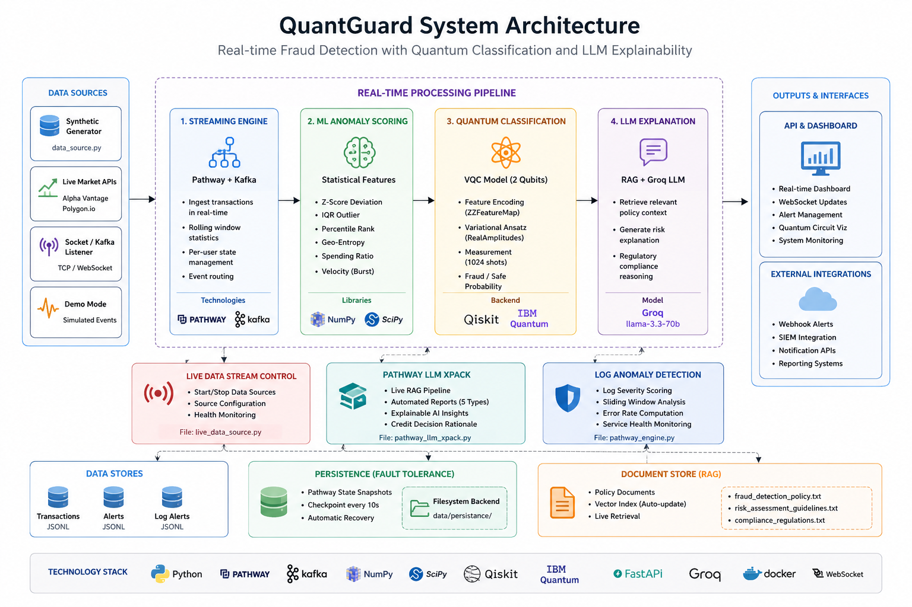

<p align="center">
  
</p>

<h1 align="center">QuantGuard</h1>

<p align="center">
  <strong>Real-Time Quantum-Enhanced Fraud Detection for Green Bharat</strong>
</p>

<p align="center">
  <a href="#features">Features</a> &bull;
  <a href="#architecture">Architecture</a> &bull;
  <a href="#quick-start">Quick Start</a> &bull;
  <a href="#api-reference">API Reference</a> &bull;
  <a href="#configuration">Configuration</a> &bull;
  <a href="#deployment">Deployment</a> &bull;
  <a href="#testing">Testing</a> &bull;
  <a href="#sustainability">Sustainability</a> &bull;
  <a href="#contributing">Contributing</a> &bull;
  <a href="#license">License</a>
</p>

<p align="center">
  
  
  
  
  
  
  
</p>

---

## Overview

**QuantGuard** is a real-time fraud detection system that combines **Quantum Computing**, **Large Language Models**, and **Streaming Data Pipelines** to identify, classify, and explain financial fraud with sub-second latency. Built for the *Hack For Green Bharat* initiative, it quantifies the environmental impact of fraud prevention by mapping protected funds to measurable sustainability outcomes aligned with India's SDG commitments.

### Key Highlights

- **2-qubit Variational Quantum Circuit (VQC)** trained via COBYLA optimization — 97% accuracy, 95.8% F1 score
- **Pathway streaming engine** with sliding-window aggregation, multi-source ingestion, and exactly-once semantics
- **Groq LLM (LLaMA 3.3 70B)** for RAG-powered explainable fraud analysis
- **IBM Quantum hardware** support (ibm_torino) with automatic simulator fallback
- **Model Context Protocol (MCP)** server for AI agent integration
- **Live market data** ingestion from Alpha Vantage, Polygon.io, and WebSocket streams
- **Green Bharat impact metrics** — CO2 offsets, tree equivalents, clean water, and solar energy mapped from protected funds

---

## Features

### Quantum Classification Engine
| Component | Details |
|-----------|---------|
| Architecture | ZZFeatureMap (2 reps) + RealAmplitudes ansatz |
| Qubits | 2 (4 trainable parameters) |
| Backend | IBM Quantum Hardware / Qiskit AER / Numpy Simulator |
| Decision Rule | P(qubit_0 = \|1>) > 0.45 → FRAUD |
| Training | COBYLA optimizer, 500 iterations, 200 samples |
| Performance | 97.0% Accuracy, 93.2% Precision, 98.6% Recall |

### Streaming Pipeline (Pathway)
- **Multi-source ingestion**: File polling, live generators, Apache Kafka consumer
- **Windowed aggregation**: 60s sliding windows with 10s hop
- **5-rule anomaly detection**: Z-score, IQR, geographic velocity, category deviation, composite scoring
- **6-feature ML scoring**: Statistical + behavioral features per transaction
- **Parallel pipelines**: Fraud detection + Log anomaly detection running concurrently

### LLM-Powered Intelligence
- **Fraud explanation**: Context-aware risk narratives using transaction history + quantum results
- **RAG over regulatory policies**: Compliance regulations, fraud detection policies, risk guidelines
- **Automated reports**: Executive summaries, trend analysis, compliance reports, risk assessments
- **Credit decision rationale**: Per-user risk profiles with regulatory context
- **RAGAS evaluation suite**: Faithfulness, relevancy, precision, and recall metrics

### Real-Time Dashboard
- **Glassmorphic UI** with live WebSocket updates
- **Impact timeline charts** with cumulative sustainability metrics
- **Alert stream** with risk level classification (CRITICAL / HIGH / MEDIUM / LOW)
- **Quantum circuit visualization** with Bloch-sphere state analysis

---

## Architecture

```
┌─────────────────────────────────────────────────────────────────────────────┐
│                          DATA SOURCES                                        │
│  [Transactions JSONL]  [Alpha Vantage]  [Kafka]  [Socket]  [Demo Generator] │
└────────────────┬────────────────────────────────────────────────────────────┘
                 │
                 ▼
┌─────────────────────────────────────────────────────────────────────────────┐
│                    PATHWAY STREAMING ENGINE                                   │
│  pw.io.python.read → concat_reindex → sliding_window → anomaly_filter       │
│  Feature Engineering: amount_ratio, velocity, z-score, IQR, geo-velocity    │
└────────────────┬────────────────────────────────────────────────────────────┘
                 │
          ┌──────┴──────┐
          ▼             ▼
┌──────────────┐  ┌──────────────┐
│   QUANTUM    │  │   GROQ LLM   │
│   VQC (2q)   │  │  LLaMA 3.3   │
│  ibm_torino  │  │   70B RAG    │
└──────┬───────┘  └──────┬───────┘
       │                 │
       └────────┬────────┘
                ▼
┌─────────────────────────────────────────────────────────────────────────────┐
│                         FastAPI + WebSocket                                   │
│  REST API │ MCP Server │ xPack RAG │ Live Dashboard │ Impact Metrics         │
└─────────────────────────────────────────────────────────────────────────────┘
```

---

## Quick Start

### Prerequisites
- Python 3.10+
- (Optional) Docker & Docker Compose
- (Optional) Groq API key for LLM features
- (Optional) IBM Quantum API key for hardware execution

### Local Setup

```bash
# Clone the repository
git clone https://github.com/dhanasai2/QUANTGUARD.git
cd QUANTGUARD

# Create virtual environment
python -m venv .venv
source .venv/bin/activate  # Linux/macOS
# .venv\Scripts\activate   # Windows

# Install dependencies
pip install -r requirements.txt
# Or minimal (no Pathway/quantum hardware):
pip install -r requirements-minimal.txt

# Configure environment
cp .env.example .env
# Edit .env with your API keys

# Run the application
python main_api.py
```

The server starts at **http://localhost:8000** with:
- Dashboard: http://localhost:8000
- Swagger docs: http://localhost:8000/docs
- WebSocket: ws://localhost:8000/ws

### Docker Deployment

```bash
# Full stack: API + Kafka + Producer
docker compose up --build

# Or standalone container
docker build -t quantguard .
docker run -p 8000:8000 --env-file .env quantguard
```

---

## API Reference

### Core Endpoints

| Method | Endpoint | Description |
|--------|----------|-------------|
| `GET` | `/` | Real-time glassmorphic dashboard |
| `GET` | `/api/stats` | System statistics + sustainability metrics |
| `GET` | `/api/health` | Health check (Docker HEALTHCHECK) |
| `POST` | `/api/analyze` | On-demand quantum + LLM analysis |
| `GET` | `/api/alerts` | Recent high-risk alerts |
| `GET` | `/api/transactions` | Recent transactions (file + live merged) |
| `POST` | `/api/rag/query` | RAG query over regulatory policies |
| `GET` | `/api/alerts/summary` | AI-generated executive summary |
| `GET` | `/api/quantum/info` | Quantum circuit metadata |
| `WS` | `/ws` | WebSocket for live updates |

### Pathway LLM xPack

| Method | Endpoint | Description |
|--------|----------|-------------|
| `POST` | `/api/xpack/rag` | Live RAG (real-time indexed alerts + policies) |
| `POST` | `/api/xpack/report` | Automated report generation (5 types) |
| `POST` | `/api/xpack/insight` | Explainable AI insight for a transaction |
| `POST` | `/api/xpack/credit` | Credit decision rationale for a user |
| `GET` | `/api/xpack/status` | xPack capabilities & indexed doc count |

### MCP Server (Model Context Protocol)

| Method | Endpoint | Description |
|--------|----------|-------------|
| `POST` | `/mcp/` | MCP JSON-RPC 2.0 endpoint |
| `GET` | `/mcp/tools` | List available MCP tools |
| `GET` | `/mcp/health` | MCP server health check |

### Live Data Sources

| Method | Endpoint | Description |
|--------|----------|-------------|
| `POST` | `/api/live/start` | Start live market data stream |
| `POST` | `/api/live/stop` | Stop live data source |
| `GET` | `/api/live/status` | Live source status |

### Example: Analyze a Transaction

```bash
curl -X POST http://localhost:8000/api/analyze \
  -H "Content-Type: application/json" \
  -d '{
    "user_id": "USR_001",
    "amount": 4500.00,
    "location": "Mumbai",
    "category": "Electronics"
  }'
```

Response includes quantum classification, fraud probability, circuit diagram, gate sequence, state analysis, and LLM explanation.

---

## Configuration

### Environment Variables

| Variable | Required | Description |
|----------|----------|-------------|
| `GROQ_API_KEY` | For LLM | Groq API key for LLaMA inference |
| `IBMQ_API_KEY` | For hardware | IBM Quantum Platform API key |
| `ALPHA_VANTAGE_API_KEY` | For live data | Alpha Vantage market data key |
| `POLYGON_API_KEY` | For live data | Polygon.io WebSocket key |
| `KAFKA_BOOTSTRAP_SERVERS` | For Kafka | Kafka broker address |
| `PATHWAY_PERSISTENCE_DIR` | Optional | Pathway state persistence path |

### Platform Compatibility

| Platform | Pathway Engine | Quantum Backend | Notes |
|----------|---------------|-----------------|-------|
| Linux/macOS | Native (`pw.run()`) | IBM Hardware / AER / Numpy | Full feature set |
| Windows | Compatibility layer | AER / Numpy | Auto-fallback, same API |
| Docker | Native (Linux container) | AER / Numpy | Recommended for production |

---

## Deployment

### Docker Compose Services

| Service | Description | Port |
|---------|-------------|------|
| `quantguard` | Main API + Pathway engine + dashboard | 8000, 9090 |
| `kafka` | Apache Kafka broker | 9092 |
| `zookeeper` | Kafka dependency | 2181 |
| `kafka-producer` | Synthetic transaction publisher sidecar | — |

### Health Monitoring

```bash
# Docker health check (automatic)
curl http://localhost:8000/api/health

# Engine status
curl http://localhost:8000/api/engine/status
```

---

## Testing

```bash
# Run all tests
pytest tests/ -v

# Specific test suites
pytest tests/test_quantum.py -v     # Quantum simulator + classifier
pytest tests/test_api.py -v         # API endpoints
pytest tests/test_ml_scoring.py -v  # ML feature scoring

# RAG evaluation (requires GROQ_API_KEY)
python evaluate_rag.py --verbose

# VQC training verification
python train_vqc.py --eval
```

---

## Project Structure

```
QUANTGUARD/
├── main_api.py              # FastAPI server — all endpoints + WebSocket
├── quantum_classifier.py    # 2-qubit VQC (IBM Hardware / AER / Numpy)
├── llm_engine.py            # Groq LLM + RAG over regulatory policies
├── pathway_engine.py        # Pathway streaming pipeline (native + compat)
├── pathway_compat.py        # Windows compatibility layer for Pathway
├── pathway_llm_xpack.py     # Pathway LLM xPack (RAG, reports, insights)
├── pathway_mcp_server.py    # MCP server for AI agent integration
├── live_data_source.py      # Alpha Vantage / Polygon / Socket / Demo sources
├── kafka_producer.py        # Kafka sidecar — synthetic transaction publisher
├── data_source.py           # Transaction data generator
├── train_vqc.py             # VQC weight optimizer (COBYLA)
├── evaluate_rag.py          # RAGAS-inspired RAG evaluation suite
├── static/
│   ├── dashboard.html       # Glassmorphic real-time dashboard
│   └── architecture.svg     # System architecture diagram
├── data/
│   ├── transactions.jsonl   # Transaction stream
│   ├── high_risk_alerts.jsonl  # Generated alerts
│   └── policies/            # Regulatory policy documents (RAG corpus)
├── tests/
│   ├── test_quantum.py      # Quantum gate + classifier tests
│   ├── test_api.py          # API endpoint tests
│   └── test_ml_scoring.py   # ML scoring pipeline tests
├── Dockerfile               # Multi-stage build (builder + runtime)
├── docker-compose.yml       # Full stack: app + Kafka + Zookeeper
├── requirements.txt         # Full dependencies
├── requirements-minimal.txt # Core dependencies (no Pathway/Qiskit)
├── .env.example             # Environment template
└── .gitignore
```

---

## Sustainability

### Green Bharat Impact Methodology

QuantGuard quantifies the environmental impact of fraud prevention by calculating how protected funds could be redirected to sustainability initiatives under India's national green programs.

| Metric | Conversion Rate | Source |
|--------|----------------|--------|
| CO2 Offset | INR 1,000 → 2.5 kg CO2 | Gold Standard Foundation (VERs) |
| Reforestation | INR 500 → 1 native tree | Grow-Trees.com / UNEP |
| Clean Water | INR 2 per litre | WHO/UNICEF JMP 2023 |
| Solar Energy | INR 25,000 → 1 kW panel | MNRE PM Surya Ghar Yojana |
| Green Bonds | 40% of protected funds | SEBI Green Bond Framework 2023 |

### SDG Alignment

- **SDG 6** — Clean Water and Sanitation (Jal Jeevan Mission)
- **SDG 7** — Affordable and Clean Energy (500 GW non-fossil by 2030)
- **SDG 13** — Climate Action (Net-zero 2070, 45% carbon intensity reduction)
- **SDG 15** — Life on Land (33% forest cover, Green India Mission)
- **SDG 16** — Peace, Justice and Strong Institutions (PMLA 2002, FIU-IND compliance)

---

## Technology Stack

| Layer | Technology |
|-------|-----------|
| API Framework | FastAPI + Uvicorn |
| Quantum Computing | Qiskit 1.0 + IBM Quantum Runtime |
| LLM Inference | Groq (LLaMA 3.3 70B Versatile) |
| Streaming Engine | Pathway (native) / Compatibility layer |
| Message Broker | Apache Kafka |
| Embeddings | Sentence-Transformers (all-MiniLM-L6-v2) |
| LLM Gateway | LiteLLM |
| Market Data | Alpha Vantage, Polygon.io |
| Containerization | Docker + Docker Compose |
| Testing | Pytest + RAGAS evaluation |

---

## Contributing

Contributions are welcome! This project is part of **GSSoC (GirlScript Summer of Code)**.

1. Fork the repository
2. Create a feature branch (`git checkout -b feature/your-feature`)
3. Commit your changes (`git commit -m 'Add your feature'`)
4. Push to the branch (`git push origin feature/your-feature`)
5. Open a Pull Request

---

## License

This project is open source. See the repository for license details.

---

<p align="center">
  Built with quantum circuits, streaming pipelines, and a commitment to a greener future.
</p>
